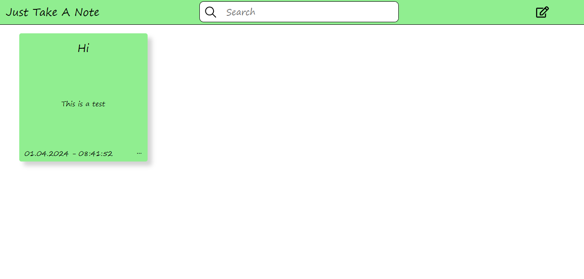

# Just Take A Note - Frontend Note Keeping App


This is a simple frontend note keeping project. This project was created with React


## Technologies

Project is created with React + Vite and designed with CSS3 + media queries


## Screenshot




### Technical Details : 

React version : 18.02.00

React-Dom version : 18.02.00

React-Icons version : 5.0.1

React-Redux version : 9.1.0

Redux-Toolkit version : 2.2.1

Vite version : 5.1.6


## Setup

To run this project, install it locally using npm

```
$ cd .../justtakeanote---react
$ npm install
$ npm run dev

```


or to preview this project :

```
$ cd .../justtakeanote---react
$ npm install
$ npm run build
$ npm run preview

```
